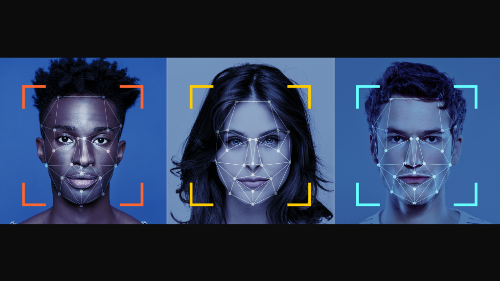

# Face Off

## Facial Expressions Detection & Emotion Prediction

## Background

We will read a large data set of videos of people performing various facial expressions and use analysis of key facial features to determine and predict which emotions are being expressed.  This training data set will be used to predict expressed emotions in a real-time video feed app.

## Motivation

We are curious to know how video feeds can pick up on human emotions through facial expressions and how accurate it could be.  This has implications for knowing whether an online audience with video feeds are enjoying a presentation, and if microexpressions can be detected with accuracy, it can also be used to determine whether emotions are genuine.  
  
Collecting this type of information is useful in determining if audiences enjoy a presentation and if so, which portions they especially enjoyed.  Conversely, it can provide information if the audiences are not enjoying a presentation and which portions of the presentation are especially bothersome.  This type of information is very useful for sales and marketing purposes to ensure that you capture the attention of your audience and delight them.  Further analysis could be done on the back end to determine if and how this data correlates to sales conversions.  

## Questions to answer

* What is the best method to measure facial expressions using video?  
* How accurate are the predictions of the emotion reading model?  
* What are the unique challenges in detecting micro expressions and what are some different approaches that could be taken to overcome these challenges?  
* What are the limitations of reading facial expressions for human emotion detection?

## References

https://www.kaggle.com/deadskull7/fer2013